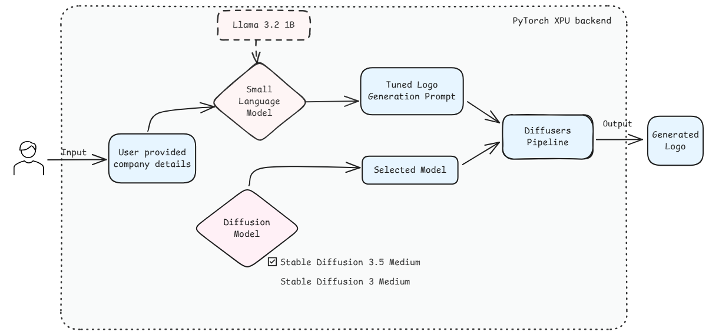
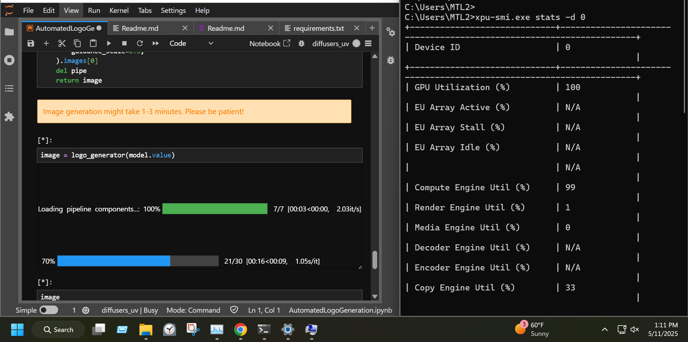
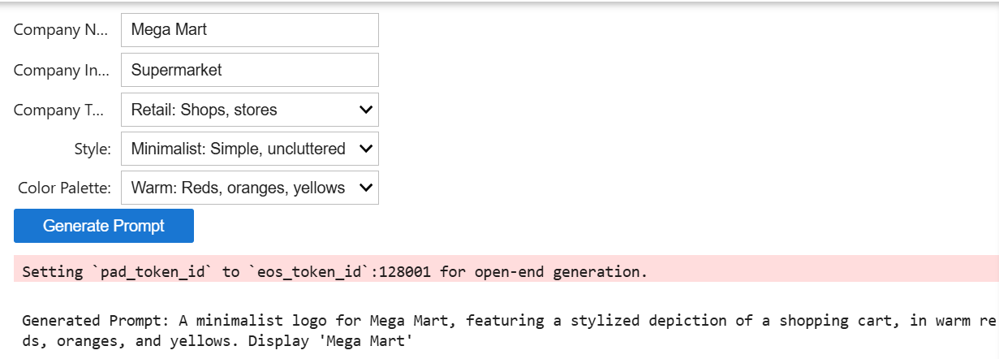

# Automated Logo Generation Sample using PyTorch XPU Backend

## Overview

Designing a compelling and effective company/brand logo is crucial yet time-consuming and expensive. This sample explores an AI-driven approach which streamlines logo generation by combining the capabitlities of small language models and diffusion models on Intel XPUs using **PyTorch XPU** backend.


## Contents

- [Sample Workflow](./Readme.md#sample-workflow)
- [Pre-requisites](./Readme.md#pre-requisites)
- [Sample structure](./Readme.md#sample-structure)
- [Run the `Automated Logo Generation` Sample](./Readme.md#sample-structure)
   - [Using `uv`](./Readme.md#using-uv)
   - [AI PC](./Readme.md#ai-pc)
- [Sample Execution](./Readme.md#sample-execution)


## Sample Workflow




## Pre-requisites

| Optimized for                      | Description                                                                                                                                                                 |
| :----------------------------------| :---------------------------------------------------------------------------------------------------------------------------------------------------------------------------|
| OS                        | Windows 11 64-bit (22H2, 23H2) and newer or Ubuntu* 22.04 64-bit (with Linux kernel 6.6+) and newer                                                                                                                                                                                                              |
| Hardware                  | Intel® Core™ Ultra Processors, Intel Arc™ Graphics, or Intel Graphics, Intel® Data Center GPU Max Series                                                                                                                                                                                                         |
| Software                  | [Intel® GPU drivers from Intel® Arc™ & Iris® Xe Graphics for Windows](https://www.intel.com/content/www/us/en/download/785597/intel-arc-iris-xe-graphics-windows.html), [uv](https://docs.astral.sh/uv/)                                                                                                                                                                                       |
| Minimum RAM required      | 32 GB or more                                                                                                                                                                        |
| Optional                  | Monitor GPU Utilization using [Intel XPU Manager](https://github.com/intel/xpumanager)
                                                                                     


## Sample Structure

This Sample directory contains:
| Notebook                           | Description                                                                                            |
| :--------------------------------- | :----------------------------------------------------------------------------------------------------- |
| [Automated_Logo_Generator.ipynb](./Automated_Logo_Generator.ipynb) | Enables faster and affordable company logo generation using language and diffusion models with the help of automated prompt engineering  |


## Run the `Automated Logo Generation` Sample:

### Using `uv`:
The sample uses [uv](https://docs.astral.sh/uv/) for environment management. Steps to install `uv` can be found [here](https://docs.astral.sh/uv/getting-started/installation/).
> 
1. Setup the environment
   - Create a new virtual environment
        ```bash
        uv venv diffusers
        ```
   - Activate the environment
       - For Windows:
          ```bash
           diffusers\Scripts\activate
           ```
       - For Ubuntu:
         ```bash
         source diffusers/bin/activate
         ```
   - Initialize the environment
       ```bash
       uv init
       ```
2. Install Dependencies
   ```bash
   cd <path/to/Automated_Logo_Generator>
   uv pip install torch torchvision torchaudio --index-url https://download.pytorch.org/whl/xpu
   uv add --active -r requirements.txt
   ```
3. Install Jupyter Kernel from Virtual Environment
   ```bash
   uv run --active ipython kernel install --user --env VIRTUAL_ENV $(pwd)/diffusers --name=diffusers_uv
   ```
4s. Launch Jupyter Notebook
   ```bash
   uv run --active --with jupyter jupyter lab
   ```

### AI PC
<div class="alert alert-block alert-info"> <b>NOTE:</b> You can run the step on both, <b>Windows and Ubuntu</b>. </div>

1. Open the [Automated Logo Generation](./Automated_Logo_Generation.ipynb) notebook file in the jupyter notebook, select the `diffusers_uv` kernel and run the code cells one by one in the notebook.


## Sample Execution
Users would be observing GPU utilization as this sample runs is optimized to run on Intel XPUs



### Few-shot Prompt Generation using SLM
Enhancing small language model's capabilities with the help of few-shot prompting strategy, image diffusion prompt is generated from a textual company/brand information



### Logo Image Generation using Diffusion Models
Latest stable diffusion models, along with the generated prompt, is passed through the diffusion pipeline to generate a meaningful logo.


