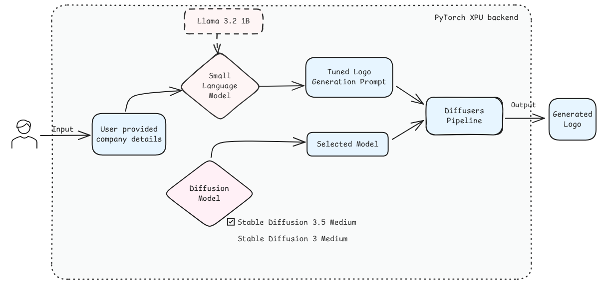
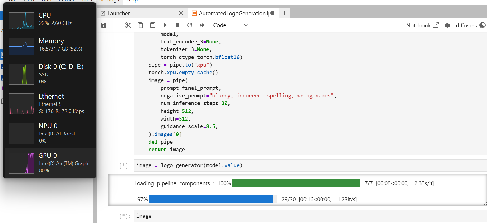
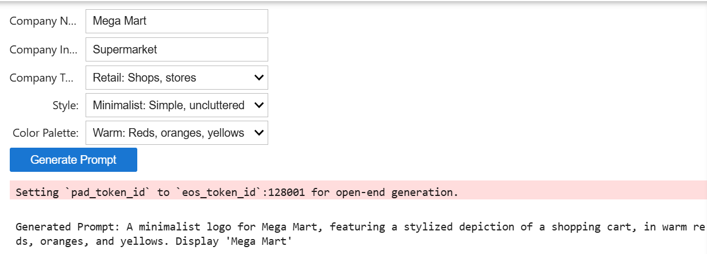

# Automated Logo Generation Sample

## Overview

Designing a compelling and effective company/brand logo is crucial yet time-consuming and expensive. This sample explores an AI-driven approach which streamlines logo generation by combining the capabitlities of small language models and diffusion models


## Contents

- Usecase Workflow
- Pre-requisites
- Sample structure
- Run the `Automated Logo Generation` Sample
   - AI PC
   - Intel Tiber Cloud
- Sample Execution


## Sample Workflow




## Pre-requisites

| Optimized for                      | Description                                                                                                                                                                 |
| :----------------------------------| :---------------------------------------------------------------------------------------------------------------------------------------------------------------------------|
| OS                        | Windows 11 64-bit (22H2, 23H2) and newer or Ubuntu* 22.04 64-bit (with Linux kernel 6.6+) and newer                                                                                                                                                                                                              |
| Hardware                  | Intel® Core™ Ultra Processors, Intel Arc™ Graphics, or Intel Graphics, Intel® Data Center GPU Max Series                                                                                                                                                                                                         |
| Software                  | [Intel® GPU drivers from Intel® Arc™ & Iris® Xe Graphics for Windows](https://www.intel.com/content/www/us/en/download/785597/intel-arc-iris-xe-graphics-windows.html)                                                                                                                  |


## Sample Structure

This Sample directory contains:
| Notebook                           | Description                                                                                            |
| :--------------------------------- | :----------------------------------------------------------------------------------------------------- |
| `AutomatedLogoGeneration.ipynb` | Enables faster and affordable company logo generation using language and diffusion models with the help of automated prompt engineering  |


## Run the `Automated Logo Generation` Sample:

### AI PC
Perform the below steps in a terminal
1. Install PyTorch for Intel XPUs. Refer [this documentation](https://docs.pytorch.org/docs/stable/notes/get_start_xpu.html) for more information.
   ```bash
   pip3 install torch torchvision torchaudio --index-url https://download.pytorch.org/whl/xpu
   ```
2. Create a conda environment
   ```bash
   conda create -n diffusers -y
   ```
   ```bash
   conda activate diffusers
   ```
   ```bash
   python -m ipykernel install --user --name=diffusers
   ```
   ```bash
   pip install -r requirements.txt
   ```
3. Open the [Automated Logo Generation](./Automated_logo_generation.ipynb) notebook file in the jupyter notebook, select the `diffusers` kernel and run the code cells one by one in the notebook.


### Intel Tiber Cloud
1. Open the [Automated Logo Generation](./Automated_logo_generation.ipynb) notebook file in the jupyter notebook, select the `PyTorch 2.7` kernel.
2. Install necessary dependencies from [requirements.txt](./requirements.txt) file.
3. Run the code cells one by one in the notebook.


## Sample Execution
Users would be observing GPU utilization as this sample runs is optimized to run on Intel XPUs



### Few-shot Prompt Generation using SLM
Enhancing small language model's capabilities with the help of few-shot prompting strategy, image diffusion prompt is generated from a textual company/brand information



### Logo Image Generation using Diffusion Models
Latest stable diffusion models, along with the generated prompt, is passed through the diffusion pipeline to generate a meaningful logo.


